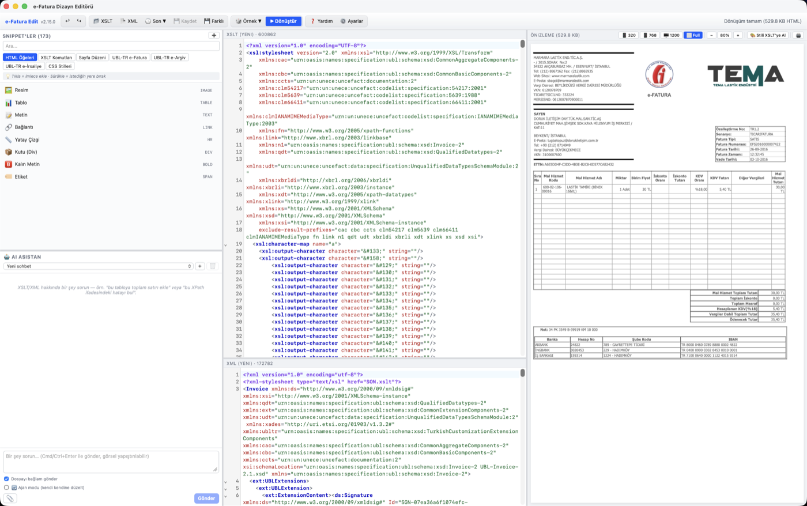
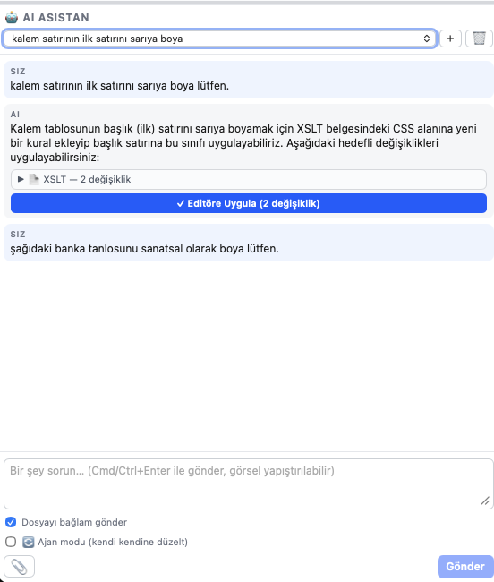
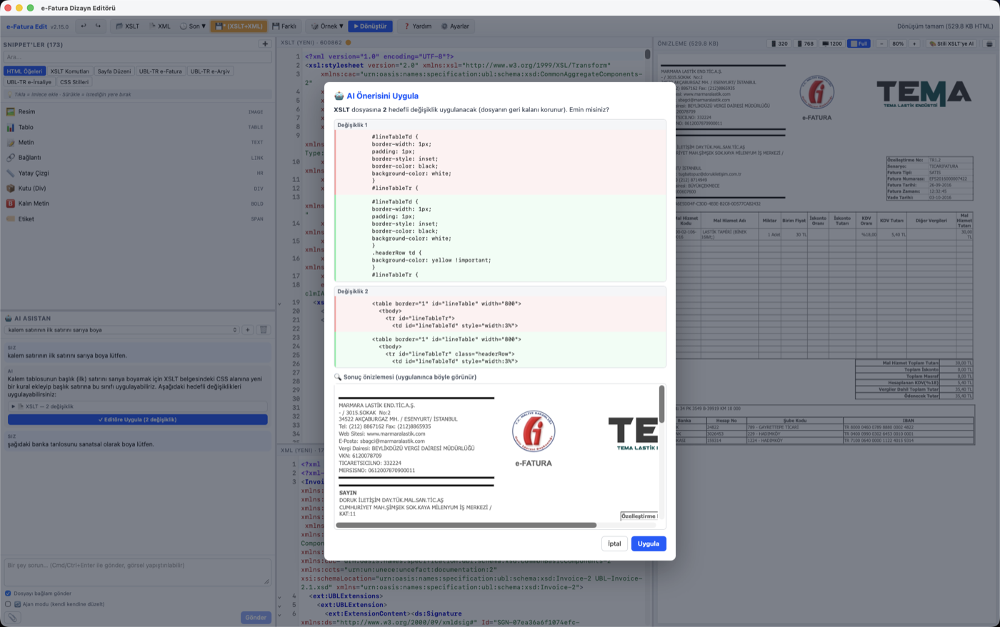
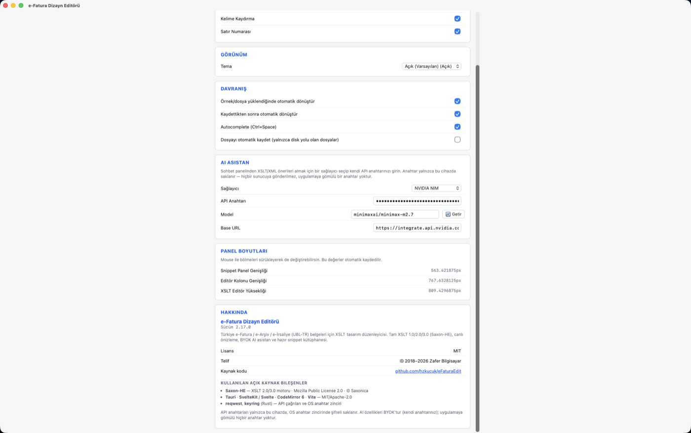

# E-FaturaEdit

Türkiye e-Fatura / e-Arşiv / e-İrsaliye (UBL-TR) belgeleri için XSLT tasarım
düzenleyicisi. GİB'in gönderdiği ham XML verisini, kendi HTML/CSS tasarımınızla
görsel bir belgeye dönüştüren XSLT şablonlarını yazmanızı ve canlı önizlemesini
görmenizi sağlar.

## Özellikler

- **CodeMirror 6 tabanlı XSLT/XML editörü** — syntax highlight, 11 tema, autocomplete (242 öneri), Türkçeleştirilmiş arama.
- **149 hazır UBL-TR snippet'i** (e-Fatura, e-Arşiv, e-İrsaliye) + kullanıcı tanımlı snippet ekleme/düzenleme/silme.
- **Sürükle-bırak** snippet ekleme (editöre veya doğrudan önizlemeye).
- **Canlı önizleme** — responsive boyut/zoom, DevTools ile CSS düzenleyip tek tıkla XSLT'ye aktarma.
- **Önizleme sağ tık menüsü (v2.33.0)** — **önizlemede ara (⌘/Ctrl+F, vurgulu, `3/17` sayacı)**, seçimi/metni kopyala, tümünü seç, yakınlaştır/uzaklaştır, yazdır/PDF. Logo veya QR gibi bir **görsele** sağ tıklayınca: görseli kopyala / kaydet.
- **Çoklu dosya sekmesi** — her sekme bir XSLT+XML çifti ve kendi önizlemesi (`Cmd/Ctrl+T`, `Cmd/Ctrl+1…9`, `Ctrl+Tab`). Kaydedilmemiş çalışma asla ezilmez, çıkış koruması tüm sekmeleri kapsar.
- **17 GİB resmi örnek senaryosu** + kullanıcı kendi örnek klasörünü yönetebilir.
- **Otomatik dönüştür, otomatik kaydet, çıkışta kaydetme kontrolü.**
- **Kapsamlı yardım sistemi** (F1) — aranabilir, sidebar navigasyonlu dokümantasyon.
- **Cross-platform:** macOS, Windows, Linux — tek kod tabanı (Tauri v2 + SvelteKit).

- **🤖 AI Asistan (BYOK)** — Claude / ChatGPT / Gemini / Ollama / NVIDIA ile XSLT/XML tasarımına yardım. Hedefli bul/değiştir düzenlemeleri, kendi kendine düzelten ajan modu, onay öncesi canlı önizleme; görsel/PDF/dosya ekleme (vision). Anahtarlar **OS anahtar zincirinde şifreli** saklanır, hiçbir anahtar gömülü/paylaşılı değildir.
- **🧠 AI Yetenekleri (v2.32.0)** — Asistana uzmanlık paketleri eklenir: *modern & sanatsal tasarım*, *A4/baskı ustalığı*, *ileri XSLT 2.0/3.0*, *ileri XPath*, *baskı-güvenli modern CSS*, *önizlemede JavaScript*. Kendi paketini de yazabilirsin. Seçim **her sağlayıcı için ayrıdır** ve token maliyeti Ayarlar'da gösterilir. (Ayarlar → AI → Yetenekler)
- **CSS Stilleri snippet kategorisi** — hazır metin/kutu/yerleşim/tablo/sayfa CSS kuralları.

Detaylı liste için [FEATURES.md](FEATURES.md).

## Ekran Görüntüleri

<!-- Görseller docs/screenshots/ altına eklenince görünür. -->
| Ana pencere | AI Asistan |
| :---: | :---: |
|  |  |
| **AI önerisini uygula (diff + önizleme)** | **Ayarlar** |
|  |  |

## İndir

Hazır kurulum paketleri: **[Releases](https://github.com/hzkucuk/eFaturaEdit/releases/latest)**

| Platform | Paket |
| --- | --- |
| macOS (Apple Silicon) | `..._aarch64.dmg` |
| macOS (Intel) | `..._x64.dmg` |
| Windows | `..._x64-setup.exe` veya `..._x64_en-US.msi` |
| Linux | `..._amd64.AppImage` · `.deb` · `.rpm` |

Kurulduktan sonra **otomatik güncelleme** devreye girer: yeni sürüm çıkınca uygulama
açılışta haber verir, onaylarsan indirip kurar.

### ⚠️ macOS: "hasar görmüş olduğu için açılamıyor" uyarısı

macOS, `.dmg` içinden ilk açılışta **"e-Fatura Edit.app hasar görmüş"** diyebilir.
**Uygulama bozuk değildir.** Sebep şu: tarayıcıyla indirilen dosyalara macOS bir
*karantina* bayrağı takar; Gatekeeper açılışta kod imzasını denetler ve paketlerimiz
(henüz) bir Apple Developer ID sertifikasıyla imzalanmadığı için macOS bu yanıltıcı
mesajı gösterir.

Çözüm — uygulamayı `Applications` klasörüne sürükledikten sonra Terminal'de **bir kez**:

```bash
xattr -dr com.apple.quarantine "/Applications/e-Fatura Edit.app"
```

Sonrasında normal şekilde açılır ve bir daha sormaz. (Otomatik güncellemeler bu adımı
gerektirmez — karantina bayrağı yalnızca tarayıcıyla indirilen dosyalara takılır.)

### Windows: "Bilinmeyen yayımcı" uyarısı

Aynı sebeple (kod imzası yok) Windows SmartScreen bir uyarı gösterebilir:
**Daha fazla bilgi → Yine de çalıştır**.

## Geliştirme

### Gereksinimler

- Rust (stable), Node.js 20+, .NET 10 SDK (yalnızca veri senkronizasyon aracı için)

Tam liste ve platforma özgü notlar için [INSTALL.md](INSTALL.md).

### Kaynaktan çalıştırma

```bash
cd app
npm install
npm run data:sync
npm run tauri dev
```

Üretim build'i için `npm run tauri build`. Ayrıntılar ve cross-compile
talimatları (macOS'ten Windows/Linux derleme dahil) için [INSTALL.md](INSTALL.md).

## Kullanım

1. **📂 XSLT** / **📄 XML** ile dosya açın, veya **🎲 Örnek** menüsünden hazır bir senaryo yükleyin.
2. Sol panelden snippet sürükleyip bırakın veya tıklayarak ekleyin.
3. **▶ Dönüştür** ile önizlemeyi güncelleyin (varsayılan olarak otomatik da çalışır).
4. **Cmd/Ctrl+S** ile kaydedin — sözdizimi hatası varsa imleç otomatik olarak hatalı satıra gider.
5. Yardım için **F1**.

### 🧪 Toplu Test — "bir şeyi düzeltirken başka bir şeyi bozdum mu?"

Editör tek seferde **tek fatura** gösterir. İskontolu faturada hizaladığın sütun, tevkifatlı faturada
kaymış olabilir ve **bunu göremezsin**. Toplu Test şablonunu bir klasördeki **tüm** faturalara karşı
çalıştırıp bu kör noktayı kapatır.

```
~/Belgeler/fatura-testleri/     ← klasördeki TÜM .xml dosyaları taranır
├── 01-temel-fatura.xml
├── 02-iskontolu.xml
├── 03-tevkifatli.xml
└── 04-25-kalemli-iki-sayfa.xml
```

1. Test edeceğin **XSLT'yi editöre yükle** (o an ekranda olan şablon kullanılır).
2. **🧪 Toplu Test** → **📁 Fatura Klasörü Seç** → koşu kendiliğinden başlar. Her satırda sonuç,
   süre, çıktı boyutu; hata varsa **Saxon'un gerçek mesajı** (satır numarasıyla). Satıra çift tıkla →
   o fatura editöre yüklenir.
3. **📸 Anlık Görüntü Al** → her çıktının **sha256**'sı saklanır.
4. Şablonu değiştir → **▶ Tekrar Çalıştır** → satırlar `aynı` / **`DEĞİŞTİ`** / `yeni` diye etiketlenir.
   **Beklemediğin bir fatura "DEĞİŞTİ" diyorsa, farkında olmadan bir şey bozmuşsundur.**

Değişiklik kasıtlıysa yeniden 📸 ile referansı tazele. Ayrıntılı anlatım: uygulama içi **F1 → 🧪 Toplu
Test**.

## Katkıda Bulunma

Bu proje MIT lisansı ile açık kaynaktır. Hata bildirimi, öneri ve pull request'ler memnuniyetle karşılanır.

## Lisans

[MIT](LICENSE) © 2026 Hüseyin Küçük — ticari kullanım dahil serbesttir; tek şart telif bildirimini korumak.

Türkçe açıklaması: **[LICENSE.tr.md](LICENSE.tr.md)** (bilgilendirme amaçlıdır; bağlayıcı olan
İngilizce [`LICENSE`](LICENSE) dosyasıdır).
